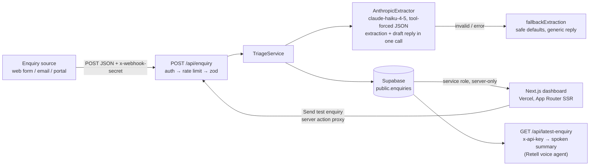

# Property Enquiry Triage Agent

An AI-assisted triage pipeline for a real-estate agency's inbound enquiries — now a single, self-contained Next.js app (the previous n8n intake is retired). A secured webhook receives the raw enquiry, Claude extracts structured intent and drafts a personalised reply in one call, everything is stored in Supabase, and the dashboard is the read-side view for agents.

## Architecture



Everything runs inside this app (OOP with constructor injection, zod schemas as the single source of truth for types/enums):

- `src/lib/schemas.ts` — `EnquiryPayloadSchema`, `ExtractionSchema`, derived types.
- `src/lib/security.ts` — constant-time `verifySecret` (`timingSafeEqual`) + sliding-window `RateLimiter`.
- `src/lib/extractor.ts` — `Extractor` interface, `AnthropicExtractor` (tool-forced JSON, zod-validated), shared `fallbackExtraction`.
- `src/lib/repository.ts` — `EnquiryRepository` interface, `SupabaseEnquiryRepository`.
- `src/lib/triage-service.ts` — orchestration: LLM failures fall back (enquiry is never lost, `extraction_ok: false`); repository failures propagate to a generic 500.
- `src/lib/container.ts` — lazy, server-only wiring from env (builds succeed without env vars).

## Setup

1. **Supabase**: create a project, then run [`supabase/schema.sql`](supabase/schema.sql) in the SQL editor.
2. **Env vars**: copy `.env.example` to `.env.local` and fill in:
   - `SUPABASE_URL` / `SUPABASE_SERVICE_ROLE_KEY` — server-only; never `NEXT_PUBLIC_`
   - `ANTHROPIC_API_KEY` — server-only, used for extraction + draft replies
   - `WEBHOOK_SECRET` — required on `POST /api/enquiry` (generate: `openssl rand -hex 32`)
   - `LATEST_ENQUIRY_TOKEN` — required on `GET /api/latest-enquiry`
3. **Run**:

```bash
npm install
npm run dev      # dashboard at http://localhost:3000
npm run test     # unit tests (vitest)
npm run build    # production build
```

## Sending an enquiry

```bash
curl -X POST https://YOUR-APP.vercel.app/api/enquiry \
  -H "Content-Type: application/json" \
  -H "x-webhook-secret: YOUR_WEBHOOK_SECRET" \
  -d '{
    "name": "Sarah Nguyen",
    "email": "sarah.nguyen@example.com",
    "source": "website",
    "message": "Hi, I'\''m looking to buy a 3-bedroom house in Richmond, budget around $1.2M. We'\''ve just sold our apartment so we'\''re ready to move quickly — could someone call me this week?"
  }'
```

Responses: `201 {ok, enquiry, draft_reply, extraction_ok}` · `401` bad/missing secret · `429` rate limited · `400` field-level zod errors · `500 {ok:false, error:"internal error"}` (internals are never leaked).

## Security

- **Webhook auth**: `x-webhook-secret` compared in constant time (`crypto.timingSafeEqual` with a length guard) — no early-exit string comparison.
- **Rate limiting**: 10 requests/min per IP (first `x-forwarded-for` hop, else `unknown`) → `429`.
- **Validation**: zod rejects invalid payloads with field-level errors before anything is stored.
- **Secrets**: all via env; the "Send test enquiry" button calls a Next.js server action, so `WEBHOOK_SECRET` never reaches the client. The Anthropic key and Supabase service-role key are server-only.
- **Database**: RLS enabled, no anon policies; all DB access is server-side via the service role.
- **Headers**: `X-Content-Type-Options: nosniff`, `X-Frame-Options: DENY`, `Referrer-Policy: strict-origin-when-cross-origin` on every response (next.config).
- **Error hygiene**: internal errors are logged server-side and mapped to generic messages.

## Voice endpoint

`GET /api/latest-enquiry` (header `x-api-key: LATEST_ENQUIRY_TOKEN`) returns the newest enquiry plus a `spoken` string for the Retell voice agent. Email is excluded from this endpoint.

## Trade-offs (trial scope)

- **In-memory rate limiter** — per-instance state only; resets on deploy and doesn't coordinate across serverless instances. Honest for a trial; the `RateLimiter` sits behind a small surface so an Upstash/Redis implementation can swap in.
- **Single LLM call** does both extraction and reply drafting — cheaper/faster, at the cost of coupling: a failed call degrades both. The zod-validated fallback guarantees the enquiry is still stored with safe defaults and a generic warm reply (`extraction_ok: false`).
- **No dashboard auth** — the dashboard shows enquirer PII and is publicly reachable. Out of scope for the trial; production would put it behind auth (e.g. Vercel protection or a login).
- **Server-rendered, not realtime** — the dashboard re-queries per request (`force-dynamic`); Supabase Realtime would be the next step if agents needed live updates.
