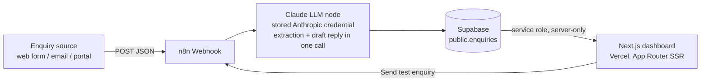

# Property Enquiry Triage Agent

An AI-assisted triage pipeline for a real-estate agency's inbound enquiries. Raw enquiries (web form, email, portal) hit an n8n webhook, an LLM extracts structured intent and drafts a reply, the result is stored in Supabase, and this Next.js dashboard is the read-side view for agents.

## Architecture



- **n8n** owns intake and enrichment: the webhook receives the raw payload, a single Claude call extracts `intent`, `urgency`, `property_address`, `budget`, a one-line `summary`, and a `draft_reply`, and the row is inserted into Supabase. The Anthropic API key lives in an n8n stored credential — it never touches this app.
- **Supabase** is the system of record. RLS is enabled with no anon policies, so only service-role callers (n8n and this app's server) can touch the table.
- **This app** is a server-rendered, read-only dashboard (`dynamic = 'force-dynamic'`), deployed on Vercel. The only client-side interactivity is the "Send test enquiry" button, which POSTs a sample payload straight to the n8n webhook and refreshes the page.

## Setup

1. **Supabase**: create a project, then run [`supabase/schema.sql`](supabase/schema.sql) in the SQL editor.
2. **n8n**: import/build the intake workflow (Webhook → Claude extraction → normalize → Supabase insert). Note the production webhook URL.
3. **Env vars**: copy `.env.example` to `.env.local` and fill in:
   - `SUPABASE_URL` — project URL
   - `SUPABASE_SERVICE_ROLE_KEY` — service role key (server-only; never `NEXT_PUBLIC_`)
   - `NEXT_PUBLIC_WEBHOOK_URL` — the n8n webhook URL
4. **Run**:

```bash
npm install
npm run dev      # dashboard at http://localhost:3000
npm run test     # unit tests (vitest)
npm run build    # production build
```

## Triggering the webhook manually

```bash
curl -X POST https://YOUR-N8N-INSTANCE/webhook/enquiry-intake \
  -H "Content-Type: application/json" \
  -d '{
    "name": "Sarah Nguyen",
    "email": "sarah.nguyen@example.com",
    "source": "website",
    "message": "Hi, I'\''m looking to buy a 3-bedroom house in Richmond, budget around $1.2M. We'\''ve just sold our apartment so we'\''re ready to move quickly — could someone call me this week?"
  }'
```

## Trade-offs (trial scope)

- **Single LLM call** does both extraction and reply drafting. Cheaper and faster than two calls; the trade-off is that a malformed response degrades both. `src/lib/normalize.ts` (unit-tested) shows the validation approach: out-of-enum values are clamped and garbage input falls back to safe defaults, so a bad LLM response can never poison the table.
- **No webhook auth**. In production I would add an HMAC signature header (shared secret, verified in an n8n Code node) or at minimum a static bearer token, plus rate limiting.
- **Server-rendered, not realtime**. The dashboard re-queries on every request (`force-dynamic`), which is simple and correct for the volume in scope. If agents needed live updates, Supabase Realtime subscriptions on the client would be the next step — at the cost of shipping an anon key and adding read policies.
- **Service role key on the read side**: acceptable because the app is server-rendered and the key never reaches the browser; a scoped Postgres role would be a hardening step.

## Voice bonus

_Placeholder — a voice intake channel (e.g. phone call → transcription → same n8n extraction pipeline) would slot in as an additional source; the schema's `source` and `raw` columns already accommodate it._
